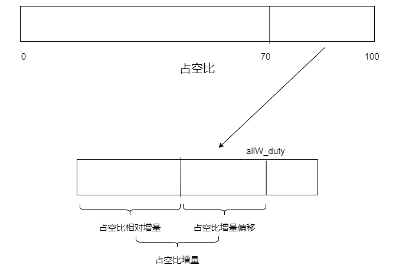

# 小车 #

## 研发进度 ##

目前实现了数据包的接收。		--2023-01-19-01-05--

实现了从接收缓冲区中提取一帧数据包          --2023-01-19-16-37--

## 电机 ##

## 蓝牙 ##

蓝牙需要接收数据包，先写接收一个数据包的中断服务函数。

首先修改蓝牙对应的串口三的接收标志位，设定最高位为接收成功一帧数据包，次高位为接收到数据，bit13~12为接收缓冲区溢出次数，剩下的为接收字符数目。这样修改还不能完全满足判定接收成功一帧数据，还应该在中断服务函数中添加一个判断一帧数据包接收完整程度的标志位，即在中断服务函数中添加一个uint8_t类型的静态本地变量。

## 数据包 ##

数据包分为接收数据包和发送数据包两个部分。

### 接收数据包和发送数据包简介 ###

接收数据包用于单片机接收上位机发送过来的指令。它的结构如下图所示：

接收数据包的第一个字节是 `包头字节`，最后一个字节是 `包尾字节`，在包头字节和包尾字节中间有原始数据和校验和，校验和是原始数据相加后的低8位。

发送数据包用于单片机发送状态给上位机。它的结构如下图所示：

发送数据包的第一个字节是 `包头字节`，最后一个字节是 `包尾字节`，在包头字节和包尾字节中间有 `原始数据` 和 `校验和`，校验和是原始数据相加后的低8位。

### 接收数据包解码 ###

解码接收数据包有利于我们对上位机命令的执行。

#### 验证数据包的完整性 ####

我们首先得验证接收数据包是否正确，验证方法就是利用数据包中的校验和，如果校验和准确，则认为数据包正确。

#### 解码数据包 ####

接收数据包中的 `rawData` 结构体成员是我们关注的对象，以目前（2023-01-19）的接收数据包为例：

    /* Rx */
    typedef struct Car_DataPacket_Rx_RawData{
        // bit5		->	low_AllDuty_ChangeStep
        // bit4		->	up_AllDuty_ChangeStep
        // bit3		->	low_AllDuty
        // bit2		->	up_AllDuty
        // bit1		->	isSetAction
        // bit0		->	isStop
        int8_t flag;
        // up_down和left_right的取值域为[-100,100]
        int8_t up_down;
        int8_t left_right;
    }Car_DataPacket_Rx_RawData_t;
    typedef struct Car_DataPacket_Rx{
        int8_t packet_Head;
        Car_DataPacket_Rx_RawData_t rawData;
        int8_t check_Byte;
        int8_t packet_Tail;
    }Car_DataPacket_Rx_t;

原始数据部分包含有三个成员，分别是一个标志位变量和两个方向控制变量。

##### 标志位变量flag #####

`bit0    ->  isStop`

isStop用于控制小车静止，当该标志位置位时，小车将无法移动，只有标志位清零时，小车才能移动。

`bit1    ->  isSetAction`

isSetAction用于设定小车的固定动作，当该标志位置位时，开始设定小车动作，当该标志位清零时，动作设定完毕。

`bit2    ->  up_AllDuty`

up_AllDuty用于增加所有车轮的占空比。

`bit3	->	low_AllDuty`

up_AllDuty用于降低所有车轮的占空比。

`bit4	->	up_AllDuty_ChangeStep`

up_AllDuty用于增加所有车轮的占空比变化步长。

`bit5	->	low_AllDuty_ChangeStep`

up_AllDuty用于降低所有车轮的占空比变化步长。

##### 方向控制变量 #####

`up_down`

取值域为 `[-100,100]`，设定小车前进和后退两个方向的 `占空比权重`，在所有车轮中，存在着一个由所有车轮占空比和车轮最低占空比之差的一个 `占空比增量` 的关系，我们使用占空比权重与它相乘，将得到该方向上的 `占空比相对增量`，占空比相对增量将最小占空比和所有车轮占空比之间的区域划分为 `占空比相对增量` 和 `占空比增量偏移`。

`left_right`

取值域为 `[-100,100]`，设定小车左转和右转两个方向上的 `占空比偏移权重`，使其分别与占空比相对增量和占空比增量偏移相乘，得到 `占空比偏移` 和 `占空比补偿`。

##### 方向控制变量之间的冲突 #####

当我们简单地去设定方向上的占空比时，会发现，前进和左转之间，车轮的转向是不同的，这时占空比的计算方法就需要一定的设计。

设所有车轮占空比为 `awd`，车轮的最小占空比为 `awmd`，占空比权重的绝对值为 `c1`，占空比偏移权重的绝对值为 `c2`，左侧车轮的占空比为 `ld`，右侧车轮的占空比为 `rd`。两侧车轮占空比的计算方法为，首先计算出占空比相对增量、占空比偏移和占空比补偿，再根据left_right参数确定ld和rd对应的加减操作。则有各侧车轮的占空比如下：

    直行：
    ld=awmd+(c1/100)(awd-awmd)
    rd=awmd+(c1/100)(awd-awmd)
    左转：
    ld=awmd+(c1/100)(awd-awmd)-(c2/100)(c1/100)(awd-awmd)
    rd=awmd+(c1/100)(awd-awmd)+(c2/100)((awd-awmd)-(c1/100)(awd-awmd))
    右转：
    ld=awmd+(c1/100)(awd-awmd)+(c2/100)((awd-awmd)-(c1/100)(awd-awmd))
    rd=awmd+(c1/100)(awd-awmd)-(c2/100)(c1/100)(awd-awmd)

记 `d1=c1/100`，`d2=c2/100` 则有：

    直行：
    ld=awmd+d1(awd-awmd)
    rd=awmd+d1(awd-awmd)
    左转：
    ld=awmd+d1(1-d2)(awd-awmd)
    rd=awmd+(d1+d2-d1d2)(awd-awmd)
    右转：
    ld=awmd+(d1+d2-d1d2)(awd-awmd)
    rd=awmd+d1(1-d2)(awd-awmd)

再记因子 `f1=d1`，`f2=d1(1-d2)`，`f3=d1+d2-d1d2` 则有：

    直行：
    ld=awmd+f1(awd-awmd)
    rd=awmd+f1(awd-awmd)
    左转：
    ld=awmd+f2(awd-awmd)
    rd=awmd+f3(awd-awmd)
    右转：
    ld=awmd+f3(awd-awmd)
    rd=awmd+f2(awd-awmd)

现在变成了左右两侧为最大程度转向，上下两侧可调整转弯半径。

#### 执行相应动作 ####

### 发送数据包编码 ###
